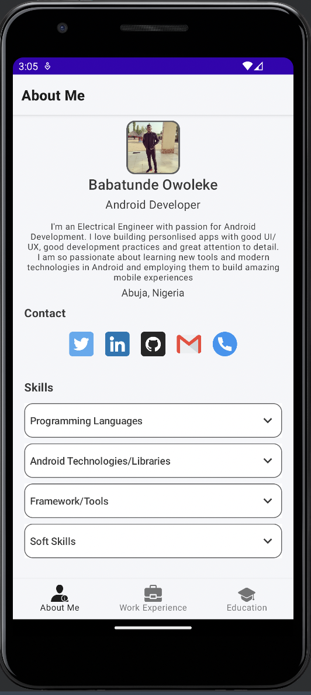
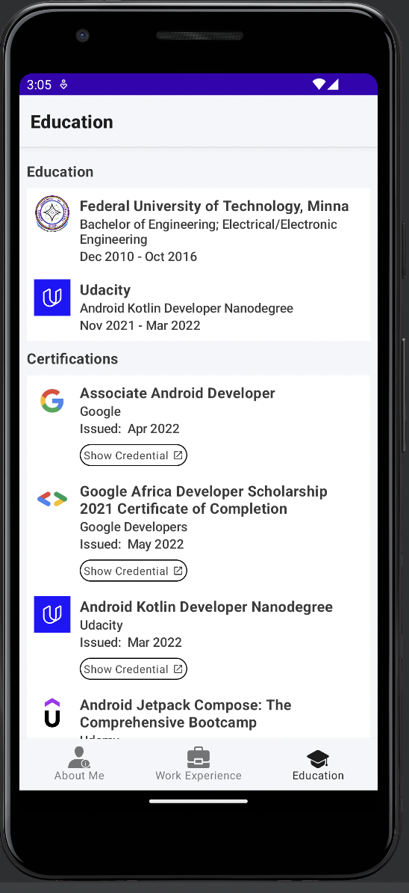
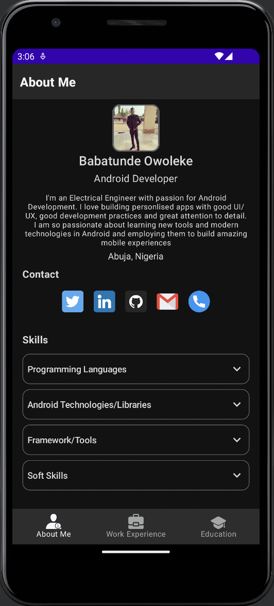

<h1> Mobile Resume</h1>
Mobile resume is an android app that showcases the resume of a developer. The app displays the resume of a developer in an interactive way where the users of app can easily 
see important information about the developer and easily open the social media account and contact details of the developer. The app aims to have a minimalistic feature so as 
to highlght important information of the developer resume.

This project was developed for HNG 9 Mobile Track Stage 2 Task.

## App Architecture and Thought Process
For this project, I wanted to apply some common app architecture principles which are seperation of concerns, driving UI from data models and single source of truth.

I created data models which would hold the data that would be displayed on the UI. I also created the ui package which houses all UI components and screen, I created
the domain package which houses the data models of the app and the data package which holds the data that would be presented on the UI and the only place the data would be coming from.

The project was built this way so that if there are new features to be added it will not be too complicated to implement them. the layers of the app are:

*  UI layer
*  Domain layer
*  Data Layer

## Design
This design for the app came about after going through design projects of sample resume app on behance and dribble. some of the designs
* [Design 1](https://dribbble.com/shots/15061439-Personal-Portfolio-Resume-CV-Mobile-Shots)
* [Design 2](https://dribbble.com/shots/13670435-Job-Board)

 I finally decided to go with doing something simple. I decided on having three screens each holding a section of in the app. The sections are:
*  About Me
*  Work Experience
*  Education

The sections would be navigated to using the bottom navigation component.
The approach of the app design was to be minimalistic and only highlight important information on the screen.

##  Libraries and Components

The project leverages the following components and libraries :
*  [Jetpack Compose](https://developer.android.com/jetpack/compose) - used to build the UI components.
*  [Compose Destinations](https://composedestinations.rafaelcosta.xyz/) - used for compose navigation.
*  [Flow Layout](https://github.com/google/accompanist/tree/main/flowlayout) - used to layout ui items on on the screen.
*  [ViewModel](https://developer.android.com/reference/androidx/lifecycle/ViewModel) - UI related data holder, lifecycle aware.

##  Nice to have features to add if time would permit
* Connecting the app to a backend service thereby making it possible to add or remove new data that should be diplayed on the app.

## Project Download
If you want to try out the project on your device. you can download the project apk using this link
*  [Download link](https://github.com/t2dbabz/MobileResume/raw/main/app/release/MobileResume.apk)

## Challenges 
Setting up the Dark and Light Theme using Material Theme. I had to try out different color combination on the material theme variables to know how the ui components responds to the colors.
I eventually settled for final color of the app. I still need to properly know how to make use of material theming in jetpack compose.

## Project Demo
Here is an link to try out the app on Appetize
*  [Demo link](https://appetize.io/app/4xqygz3gbkmnch3ase7gt4442y)

## Screenshots
<table>
    <tr>
    <td>About Me</td>
      <td>Education Screen</td>
    <td>Dark Mode</td>
  </tr>
   <tr>
    <td></td>
    <td></td>
    <td></td>
  </tr>
  </table>
